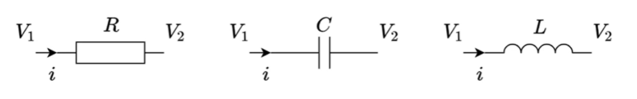
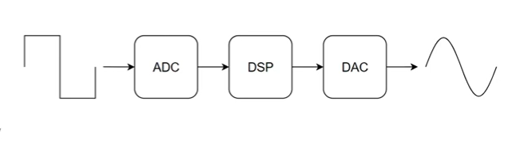
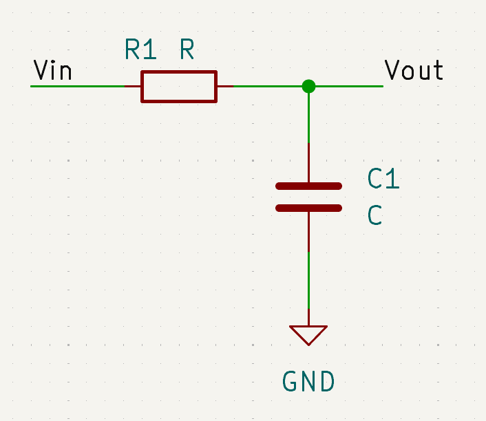

# STM32 DSP
## I. Real-Time Software Implementation of Analog Filters (RC low pass filter)
### 1. Overview
#### Analog filter

|Linh kiện|Công thức|
|:--------|:--------|
|R|$$ i = \frac{V_1 - V_2}{R} $$|
|C|$$ i = C\frac{d(V_1 - V_2)}{dt} $$|
|L|$$ i = \frac{1}{L} \int (V_1 - V_2) \, dt $$|
#### Digital filter

- dễ dàng triển khai, thay đổi tham số của bộ lọc
- giá thành thấp

### Example: RC low-Pass filter
#### Theory

$$ V_{out} + RC\frac{d(V_{out})}{dt}  = V_{in} $$
- Định luật Euler lùi
$$ \frac{d(V)}{dt} \approx \frac{V_n - V_{n-1}}{T} $$
- RC lo
$$ V_{out} [n] = \frac{T}{T+RC} V_{in} [n] + \frac{RC}{T+RC} V_{out} [n-1] $$
- Đáp ứng của bộ lọc
$$ f_{-3dB} = \frac{T}{2 \pi RC}$$
#### Implement software
`.\Tutorial-Templates\001_RCFilter`
## Z transform

