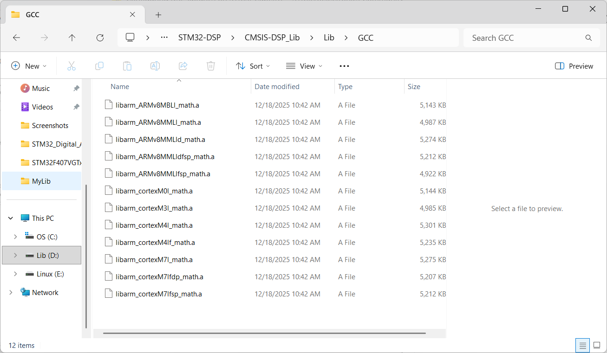
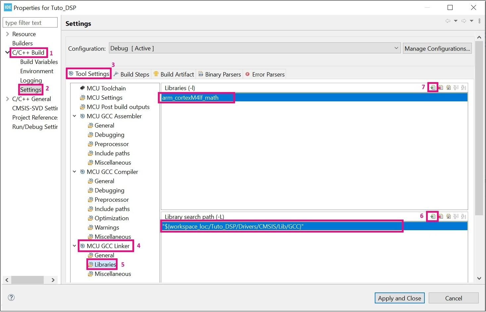

# STM32 DSP
## I. Thêm tư viện CMSIS-DSP cho STM32F4

### 1. Including the DSP libraries and header files
- Thư viện CMSIS-DSP Lib: `.\CMSIS-DSP_Lib`
- Cấu trúc của một project


### 2. Include paths
- Select the project from the Project Explorer section
- From Project menu or File menu, go to Project properties > C/C++ Build > Settings > Tool Settings > MCU GCC Compiler > Include paths.
- Click on “Add” to include the new paths.
- Add ../Drivers/CMSIS/DSP/Include path


### 3. Update libraries
- Thêm đường dẫn thư viện
    -  Project Explorer section > Project Properties > C/C++ Build > Settings > Tool Settings > MCU CGC Linker > Libraries > Library search Path > Add.
    - chọn GCC library path: `../Drivers/CMSIS/Lib/GCC`

- Thêm thư viện 
    - chọn thư viện DSP cho ARM cortex Mx: bỏ lib của file thư viện .a
    
    - Thêm thư viện: Project Explorer section > Properties > C/C++ Build > Settings > Tool Settings > MCU CGC Linker > Libraries > Libraries (-l) > add
    


### 4. Update file source
- Open SupportFunctions.c and SupportFunctionsF16.c files and comment these lines of code:
    - SupportFunctions.c 
    ``` C
    #include "arm_barycenter_f32.c"
    #include "arm_bitonic_sort_f32.c"
    #include "arm_bubble_sort_f32.c"
    #include "arm_copy_f32.c"
    #include "arm_copy_f64.c"
    #include "arm_copy_q15.c"
    #include "arm_copy_q31.c"
    #include "arm_copy_q7.c"
    #include "arm_fill_f32.c"
    #include "arm_fill_f64.c"
    #include "arm_fill_q15.c"
    #include "arm_fill_q31.c"
    #include "arm_fill_q7.c"
    #include "arm_heap_sort_f32.c"
    #include "arm_insertion_sort_f32.c"
    #include "arm_merge_sort_f32.c"
    #include "arm_merge_sort_init_f32.c"
    #include "arm_quick_sort_f32.c"
    #include "arm_selection_sort_f32.c"
    #include "arm_sort_f32.c"
    #include "arm_sort_init_f32.c"
    #include "arm_weighted_sum_f32.c"

    #include "arm_float_to_q15.c"
    #include "arm_float_to_q31.c"
    #include "arm_float_to_q7.c"
    #include "arm_q15_to_float.c"
    #include "arm_q15_to_q31.c"
    #include "arm_q15_to_q7.c"
    #include "arm_q31_to_float.c"
    #include "arm_q31_to_q15.c"
    #include "arm_q31_to_q7.c"
    #include "arm_q7_to_float.c"
    #include "arm_q7_to_q15.c"
    #include "arm_q7_to_q31.c"
    ```
    - SupportFunctionsF16.c
    ``` C
    #include "arm_copy_f16.c"
    #include "arm_fill_f16.c"
    #include "arm_f16_to_q15.c"
    #include "arm_f16_to_float.c"
    #include "arm_q15_to_f16.c"
    #include "arm_float_to_f16.c"
    #include "arm_weighted_sum_f16.c"
    #include "arm_barycenter_f16.c"
    ```